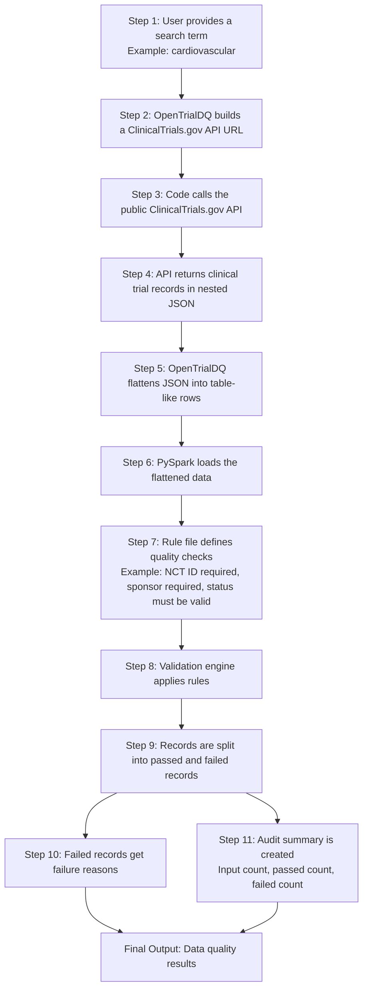

# OpenTrialDQ Use Case

## Problem Statement

Clinical trial information is publicly available through ClinicalTrials.gov, but the raw data is not always ready for analytics. Study records can be nested, inconsistent, incomplete, or difficult to review at scale.

A data engineer or analyst may want to answer basic quality questions before using the data:

- Does every study have an NCT ID?
- Is the study status valid?
- Is the sponsor name available?
- Are study dates populated correctly?
- Are there duplicate study identifiers?
- How many records passed or failed quality checks?
- Which rule failed, and why?

Without a reusable framework, teams often write one-off scripts for every dataset. That makes data quality checks harder to maintain, harder to audit, and harder to reuse across pipelines.

## What OpenTrialDQ Solves

OpenTrialDQ provides a simple reusable pattern for validating public clinical trial data.

Instead of hard-coding every check, users define validation rules in a configuration file. The framework reads those rules, applies them to clinical trial data, and produces clear outputs for review.

## Simple Use Case

A user wants to analyze clinical trials related to cardiovascular disease.

OpenTrialDQ can:

1. Search ClinicalTrials.gov for cardiovascular studies.
2. Retrieve public study records from the API.
3. Convert nested JSON records into table-like rows.
4. Apply data quality rules.
5. Separate good records from failed records.
6. Explain why each failed record failed.
7. Produce an audit summary showing total records, passed records, and failed records.

## End-to-End Flow

## Final Outputs

OpenTrialDQ produces three practical outputs:

### Passed Records

Records that satisfy the configured data quality rules.

### Failed Records

Records that fail one or more rules, including rule ID, failed column, failed value, severity, and failure reason.

### Audit Summary

A compact summary showing how many records were processed, how many passed, and how many failed.

## Who This Helps

OpenTrialDQ is useful for:

- data engineers building healthcare or life sciences pipelines,
- analysts preparing public clinical trial data for reporting,
- students learning PySpark and data quality patterns,
- teams that want reusable validation instead of one-off scripts,
- open-source contributors interested in public healthcare datasets.

## What This Project Does Not Do

OpenTrialDQ does not make medical, clinical, regulatory, or treatment claims. It does not validate whether a clinical study is scientifically correct. It focuses only on data engineering quality checks for public study metadata.

The project uses public or synthetic data only and does not use employer data, proprietary schemas, confidential business logic, or internal systems.